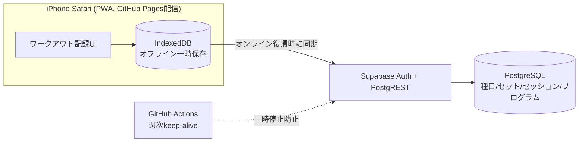
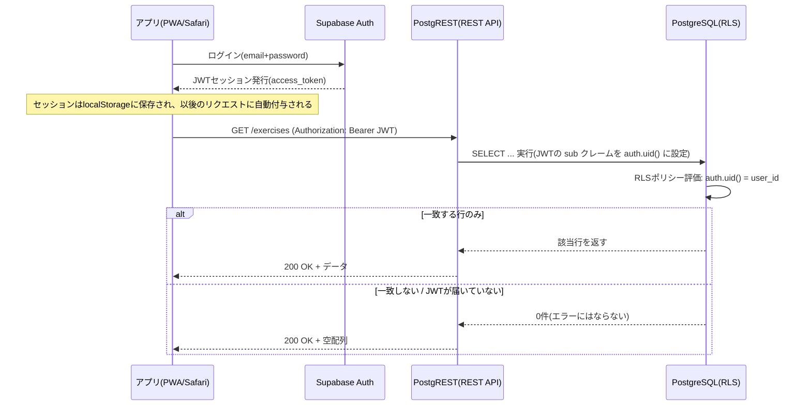

# 筋トレ記録アプリ Supabase移行 設計ドキュメント

エクスポート日: 2026-09-23

以下、Claude Docs上で作成した3つのドキュメントを1つのMarkdownファイルにまとめたものです。

1. DBアーキテクチャ移行案
2. データモデル設計
3. 実装準備

---

# 筋トレ記録アプリ DBアーキテクチャ移行案

Sep 22, 2026 · @Someone

## 背景・現状の課題

現在は筋トレ記録アプリ(Workout tracker)のデータをiPhone本体のlocalStorage(`gl_menus` / `gl_sessions` / `gl_menusets`)にのみ保存しており、サーバー通信は一切行っていない(リポジトリの`docs/basic-design.md`・`docs/detail-design.md`で確認済み)。Notionはプログラム/12週プログラムの計画管理に別途使っており、本移行の対象外とする。

localStorage依存に伴う実際の課題:

- Safariのデータピ淶去操作・機種変更・PWAアイコン削除時にデータが完全に失われるリスクがある(バックアップはCSVエクスポートの手動実行み)
- iPhone以外の端末や複数端末からの参照・編集ができない
- バックアップ・復旧が自動化されておらず、CSVエクスポートを忘れると復元不可能
- バックログに`B-04b: Supabase連携(クラウドDBへのデータ同期・バックアップ自動化)`が保留項目として既に存在しており、今回の検討はその実現にあたる

## 要件・制約整理

今回のアーキテクチャ選定に影響する前提条件:

| 項目 | 内容 |
| --- | --- |
| 利用規模 | 開発者兼ユーザーは本人のみ(シングルユーザー)。多人数同時アクセスや複雑な認証基盤は不要 |
| コスト | 無料枠で運用できることを最優先。有料化する場合も月数百円程度に押さえたい |
| フロント | 現行の Workout tracker(Web/PWA)をGitHub Pagesの静的ホスティングに乗せたまま測いたい。フロント側のサーバー運用は避けたい |
| 対象環境 | iPhone Safari 上のPWAが主ターゲット。HealthKit/ウィジェットは利用不可 という既知の制約あり |
| ネットワーク | ジムでの利用を想定し、リンクが不安定な環境でも記録が止まらないんとが望ましい(オフライン書き込み→後で同期) |
| データ構造 | 種目・セット(重量・rep数)・セッション・プログラム(メニュー)のリレーショナル構造を想定。集計クエリ(種目別PR推移など)を実行しやすいこと |
| 開発環境 | Windows PC で開発。バックエンドはClaude Codeでの実装を想定 |
| 運用負荷 | ソロ開発のため、サーバーの運用・監視コストが低いこと(マネージドサービス優先) |

※ジムでのオフライン耐性とデータ構造の詳細は、本人の使い方に依存するため、このドキュメント末尾のコメントで確認する。

## アーキテクチャ選択肢の比較

コスト・運用負荷・静的フロント(GitHub Pages)との相性を基準に、代表的な候補を5つ比較した。

| サービス | 無料枠(主な制限) | フロントからの直接利用 | データ駋造 | 運用負荷 | 注意点 |
| --- | --- | --- | --- | --- | --- |
| **Supabase** | DB 500MB、MAU 5万、エグレス 5GB/月、プロジェクト2つまで | ◎ 自動生成REST(PostgREST)+JS SDKでサーバー不要 | PostgreSQL(リレーショナル) | ほぼゼロ(フルマネヸジド) | 無料プロジェクトは非アクティブ1週間で一時停止 |
| **Firebase(Firestore)** | 保存1GiB、読取5万/日、書込2万/日、転送10GB/月 | ◎ クライアントSDKでサーバー不要 | NoSQL(ドキュメント指向) | ほぼゼロ | 集計・リレーション表現SQLより不得手 |
| **Cloudflare D1 + Workers** | 容量5GB、読取500万行/日、書込10万行/日(2026年9月から強制適用) | △ Workersを自作してAPI化が必要 | SQLite(リレーショナル) | 低(Workers実装は軍い) | 非アクティブでも停止しない。GitHub Pagesとの相性良い |
| **Turso** | 容量5GB、月間読取5億行、月間書込1000万行、DB100個 | △ ブラウザ直接接続は認証トークン露出リスク、簡易APIが必要 | libSQL(SQLite互換) | 低〜中 | エッジレプリカ対応。個人利用には過剰な枠 |
| **PocketBase(自前ホスト)** | ホスティング自体に無料枠なし | ◎ REST+SDKで直接、管理画面付き | SQLite(リレーショナル) | 中〜高(サーバー運用・更新・バックアップが自己責任) | Fly.ioの無料枠が2026年に廃止され、無料での永続ホストが困難に |

※本人希望の「マネージドサービス優先・サーバー運用を避けたい」という制約に照らすと、PocketBaseは現時点では優先度低め。Tursoは単体ではフロントから安全に使えないため、別途API層が必要になる点でD1と同様の手間がかかる。

実質的にはSupabaseとCloudflare D1 + Workersの2つが有力候補となる。

出典: [Cloudflare D1 Pricing](https://developers.cloudflare.com/d1/platform/pricing/) ・ [D1無料枠強制適用(2026-09)](https://developers.cloudflare.com/changelog/post/2026-09-01-d1-free-tier-limit-enforcement/) ・ [Firebase Pricing](https://firebase.google.com/pricing) ・ [Turso Pricing](https://turso.tech/pricing) ・ [Supabase Pricing](https://supabase.com/pricing) ・ [Fly.io Free Trial](https://fly.io/docs/about/free-trial/)

## 推奨アーキテクチャ案

**Supabase(PostgreSQL)をメインDBとし、IndexedDBでオフライン書き込みを吸収する構成を推奨する。**

理由:

1. 種目/セット/セッション/プログラムのリレーショナル構造とPostgreSQLの相性が良く、集計クエリ(種目別PR推移など)もSQLで自然に書ける
2. PostgRESTによりテーブル定義からREST APIが自動生成され、自作サーバーが不要(GitHub Pagesの静的フロントのまま使える)
3. 無料枠500MBは個人のトレードンね記録なら整同単位で余裕がある
4. 本人の徿の利用なので、Row Level Security(RLS)で自分のデータのみアクセス可にする最小構成で十分

一方で、Supabaseの無料プロジェクトは**非アクティブ1週間で一時停止する**。週に整囘ジムで使う想定なら場合によっては引っかかる可能性があり、GitHub Actionsで週次のpingを打つか、手動でダッシュボードから復帰させる運用が必要(ダッシュボードからの手動復帰は数秒で完了)。この停止仕様が許容できない場合は、**Cloudflare D1 + Workers**が代替案となる(非アクティブでも停止せず、無料枠もより大きが、APIを自作する分初期実装コストが上がる)。

オフライン耐性はフロント側で対応する: ワークアウト中の記録はまずIndexedDB(Dexie.jsなど)に保存し、オンライン復帰時にSupabaseへ同期するローカルファースト構成とする。



※この構成ではWorkout tracker.現行フロント(GitHub Pagesホスティンエ)・焾面構成はそのまま残り、データ層のみlocalStorage読み書きからSupabase JS SDK呼び出しに置き換える形になる。

## 移訌ステップ

1. **現行データの確認・出出炗を出乓〪* — 既存のCSVエクスポート機能(筋トレ・有酸素とも実装済み)でバックアップを取得。ただしメニューセット(`gl_menusets`)はCSV対象外のため、ブラウザのDevToolsから`localStorage.gl_menusets`を直接JSONで書き出す
2. **Supabaseプロジェクト作成・テーブル作成** — 「データモデル設計」タブのDDLを実行し、RLSを有効化
3. **移行スクリプト作成** — エクスポートしたCSV(筋トレ・有酸素)と`gl_menusets`のJSONを読み込み、exercises→workout\_sessions→sets/cardio\_logs→menu\_sets/menu\_set\_itemsの順でSupabaseへ投入するワンショットスクリプトを作成
4. **フロントのデータ層差し替え** — `persist()`や`S.menus`等のlocalStorage読み書きをSupabase JS SDK呼び出しに置き換え。既存のUI/画面構成は変更不要
5. **オフライン対応の追加** — IndexedDBへの一時保存とオンライン復帰時の同期ロジックを実装(ジムでの利用を想定)
6. **並行運用で検証後、旧localStorageコードを削除**

※Jira(MYSTプロジェクト)でチケット化して進捗管理すると、他の開発タスクと同様の進め方ができる。

## コスト試算

個人1人のトレーニング記録規模では、どの候裔も**無料枠内で長期運用可能**と見ていい。

| 項目 | Supabase無料枠 | 想定使用量(個人利用) | 判定 |
| --- | --- | --- | --- |
| DB容量 | 500MB | セット記録は1件数十バイト。年間数万件規模でも数MB程度 | 余裕十分 |
| MAU | 5万 | 1人 | 余裕十分 |
| エグレス | 5GB/月 | テキスト中心の小さなリクエストが中心 | 余裕十分 |
| プロジェクト数 | 2つまで | 1つで足りる | 問題なし |

現実的なリスクは容量やアクセス量ではなく、前述の**非アクティブ1週間でのプロジェクト一時停止**。これはGitHub Actionsの無料実行時間(publicリポジトリは完全無料、privateでも月2,000分まで無料)で週次keep-aliveを回すことで回避できるため、追加コストは発生しない。

Cloudflare D1 + Workersにした場合も、読取500万行/日・書込10万行/日は個人のワークアウト記録では到底使い切れない水準で、こちらも実質$0/月で運用できる。

※両サービスともプラン変更や価格改定の可能性はあるため、定期的に公式料金ページを確認するのが安全。

詳細なテーブル定義・ER図・DDLは データモデル設計 ヶバを参照。


---

# データモデル設計

現行リポジトリ(`training_recorder`)の`docs/basic-design.md`・`docs/detail-design.md`・`app.js`を確認し、**v1.6時点で実装済みの機能・データ構造のみ**を基に全面的に書き直した。前回版で含めていたRPE・program・1RM履歴管理などはすべて削除している(現行仕様にないため)。

## 重要: 現状のデータ保存先は localStorage

`docs/basic-design.md` §2.1/5.3 と `docs/detail-design.md` §1 を確認したところ、現行アプリは **Notionではなく iPhone本体の localStorage**(キー: `gl_menus` / `gl_sessions` / `gl_menusets`)にデータを保存しており、サーバー通信は一切行っていません。バックログには`B-04b: Supabase連携(クラウドDBへのデータ同期・バックアップ自動化)`が保留中として既に存在しており、今回の移行はこのバックログ項目の実現と一致します。

一方で、本ドキュメントの背景セクションは当初「NotionをDB代わりに使っている」という前提で書いていますが、現行リポジトリのドキュメントにはNotionの記述が一切ありません。おそらくプログラム/12週プログラムの計画部分をアプリ外(Notion)で管理しており、実際のセット記録はlocalStorageという位置付けかと推測します。この点は確認が必要です(本文末尾のコメント参照)。

## 機能一覧(現行仕様ベース / v1.6)

| 機能 | 概要 | 対応データ(現行localStorage) | 画面 |
| --- | --- | --- | --- |
| メニューの追加/編集 | 部位・種別・名前を登録・変更。同一部位内同名は重複エラー | `gl_menus` | add-menu, menu-detail |
| メニュー一覧 | 部位グループ別表示。長押しで同一部位内並び替え | `gl_menus` | menu-list |
| アーカイブ/復元/完全削除 | 記録は保持したまま一覧非表示、または完全削除 | `gl_menus.archived` | menu-list, menu-detail |
| セット記録(筋トレ) | 重量・回数を記録、1RMをリアルタイム計算(保存はしない) | `gl_sessions[id].sets[]` | set-edit |
| 有酸素運動記録 | 時間・距離・消費 Cal・心拍数・速度 | `gl_sessions[id].cardio` | set-edit(有酸素) |
| セッション管理 | 同一日複数セッション、日付・時刻変更、セッション削除 | `gl_sessions[id].date/time` | menu-detail, set-edit |
| セット編集/削除 | 記録済みセットのタップ編集・削除 | `gl_sessions[id].sets[]` | set-edit |
| メニューセット | よく使うメニューの組み合わせに名前を付けて登録 | `gl_menusets` | menuset-list, menuset-detail |
| CSVエクスポート/インポート | 筋トレ・有酸素別にCSV入出力 | `gl_menus`, `gl_sessions` | csv |
| メニュー分析(カレンダー/メニュービュー) | 記録日可視化、ボリューム/1RM推移グラフ | `gl_sessions`(集計) | analysis, analysis-detail |
| RM換算表 | 推定1RM計算・1〜10rep換算 | なし(都度計算、保存しない) | rm |
| オフライン動作 | Service Workerキャッシュ | - | 全画面 |

※1RMは常にO'Conner式(`w × (1 + r ÷ 40)`)で都度計算され、DBに专用テーブルは不要。

※B-04b(Supabase連携)以外のバックログ(B-03 React化、B-14メニューセット一括記録など)は未実装のため、今回のテーブル定義には含めていない。

## データ対応(localStorage → Supabase)

| 現行(localStorage) | 移行先(テーブル) | 備考 |
| --- | --- | --- |
| `gl_menus[]` | `exercises` | そのまま1対1 |
| `gl_sessions[menuId][sessId]`(筋トレ) | `workout_sessions` + `sets` | date/timeは`workout_sessions`、sets\[\]は`sets`に展開 |
| `gl_sessions[menuId][sessId]`(有酸素) | `workout_sessions` + `cardio_logs` | cardioオブジェクトを`cardio_logs`に1:1展開 |
| `gl_menusets[]` | `menu_sets` + `menu_set_items` | `menuIds[]`を中間テーブルに分解 |

## ER図(改訂: 現行仕様のみ反映)

```mermaid
erDiagram
    EXERCISES ||--o{ WORKOUT_SESSIONS : has
    WORKOUT_SESSIONS ||--o{ SETS : contains
    WORKOUT_SESSIONS ||--o| CARDIO_LOGS : contains
    EXERCISES ||--o{ MENU_SET_ITEMS : "included in"
    MENU_SETS ||--o{ MENU_SET_ITEMS : has

    EXERCISES {
        text id PK
        uuid user_id FK
        text name
        text category
        text type
        boolean archived
        integer sort_order
    }
    WORKOUT_SESSIONS {
        uuid id PK
        text exercise_id FK
        date session_date
        text session_time
    }
    SETS {
        uuid id PK
        uuid session_id FK
        int set_no
        numeric weight_kg
        int reps
    }
    CARDIO_LOGS {
        uuid session_id PK FK
        numeric time_min
        numeric dist_km
        numeric cal_kcal
        numeric hr_bpm
        numeric max_spd_kmh
        numeric avg_spd_kmh
    }
    MENU_SETS {
        uuid id PK
        uuid user_id FK
        text name
    }
    MENU_SET_ITEMS {
        uuid menu_set_id PK FK
        text exercise_id PK FK
    }
```

## テーブル定義(改訂)

### exercises(旧 gl\_menus)

| カラム | 型 | 制約 | 対応するgl\_menusフィールド |
| --- | --- | --- | --- |
| id | text | PK | id(旧: `menu_`+timestamp文字列。text型のまま移行し、gl\_sessions等からの参照を維持) |
| user\_id | uuid | FK→auth.users, NOT NULL | (新規、RLS用) |
| name | text | NOT NULL, 全角30文字以内 | name |
| category | text | NOT NULL | category(胸/背中/肩/足/腕/その他/有酸素運動) |
| type | text | NOT NULL | type(マシン/フリーウェイト/自重運動/有酸素運動) |
| archived | boolean | NOT NULL, default false | archived |
| created\_at | timestamptz | NOT NULL, default now() | (新規) |
| sort\_order | integer | NOT NULL, default 0 | (新規、UC-32 並び替え用。同一category内の表示順) |

### workout\_sessions(旧 gl\_sessions の date/time部分)

| カラム | 型 | 制約 | 備考 |
| --- | --- | --- | --- |
| id | uuid | PK | 旧: `sess_`+timestamp |
| exercise\_id | uuid | FK→exercises, NOT NULL | 旧: menuId(キー) |
| session\_date | date | NOT NULL | date |
| session\_time | text | NOT NULL, default '00:00' | time(app.js実装のみでdetail-design.md未記載だったフィールド) |
| created\_at | timestamptz | NOT NULL, default now() | (新規) |

### sets(旧 gl\_sessions\[\].sets\[\])

| カラム | 型 | 制約 | 備考 |
| --- | --- | --- | --- |
| id | uuid | PK | (旧: 配列インデックス、リレーション化に伴い新規付与) |
| session\_id | uuid | FK→workout\_sessions, NOT NULL |  |
| set\_no | int | NOT NULL | 配列順(1始まり) |
| weight\_kg | numeric | NOT NULL | w(自重運動は0が入る仕様を継続) |
| reps | int | NOT NULL | r |

### cardio\_logs(旧 gl\_sessions\[\].cardio)

| カラム | 型 | 制約 | 備考 |
| --- | --- | --- | --- |
| session\_id | uuid | PK, FK→workout\_sessions | 1セッションに1行 |
| time\_min | numeric | NULL可 | time(必須項目だが未入力時nullを許容) |
| dist\_km | numeric | NULL可 | dist |
| cal\_kcal | numeric | NULL可 | cal |
| hr\_bpm | numeric | NULL可 | hr |
| max\_spd\_kmh | numeric | NULL可 | maxSpd(任意) |
| avg\_spd\_kmh | numeric | NULL可 | avgSpd(任意) |

### menu\_sets(旧 gl\_menusets)

| カラム | 型 | 制約 | 備考 |
| --- | --- | --- | --- |
| id | uuid | PK | 旧: `mset_`+timestamp |
| user\_id | uuid | FK→auth.users, NOT NULL | (新規、RLS用) |
| name | text | NOT NULL, 全角30文字以内 | name |
| created\_at | timestamptz | NOT NULL, default now() | (新規) |

### menu\_set\_items(旧 gl\_menusets\[\].menuIds\[\])

| カラム | 型 | 制約 | 備考 |
| --- | --- | --- | --- |
| menu\_set\_id | uuid | PK, FK→menu\_sets |  |
| exercise\_id | uuid | PK, FK→exercises | 参照先が削除済みの場合は一覧から除外(現行仕様と同じ) |

## DDL(Supabase SQL Editorで実行可能)

```sql
create table exercises (
  id text primary key,
  user_id uuid not null references auth.users(id) default auth.uid(),
  name text not null,
  category text not null,
  type text not null,
  archived boolean not null default false,
  sort_order integer not null default 0,
  created_at timestamptz not null default now()
);

create table workout_sessions (
  id uuid primary key default gen_random_uuid(),
  exercise_id text not null references exercises(id) on delete cascade,
  session_date date not null,
  session_time text not null default '00:00',
  created_at timestamptz not null default now()
);

create table sets (
  id uuid primary key default gen_random_uuid(),
  session_id uuid not null references workout_sessions(id) on delete cascade,
  set_no int not null,
  weight_kg numeric not null,
  reps int not null
);

create table cardio_logs (
  session_id uuid primary key references workout_sessions(id) on delete cascade,
  time_min numeric,
  dist_km numeric,
  cal_kcal numeric,
  hr_bpm numeric,
  max_spd_kmh numeric,
  avg_spd_kmh numeric
);

create table menu_sets (
  id uuid primary key default gen_random_uuid(),
  user_id uuid not null references auth.users(id) default auth.uid(),
  name text not null,
  created_at timestamptz not null default now()
);

create table menu_set_items (
  menu_set_id uuid not null references menu_sets(id) on delete cascade,
  exercise_id text not null references exercises(id) on delete cascade,
  primary key (menu_set_id, exercise_id)
);

create index on workout_sessions (exercise_id);
create index on sets (session_id);
create index on exercises (user_id, category, sort_order);

alter table exercises enable row level security;
alter table menu_sets enable row level security;
alter table workout_sessions enable row level security;
alter table sets enable row level security;
alter table cardio_logs enable row level security;
alter table menu_set_items enable row level security;

create policy "owner only" on exercises for all using (auth.uid() = user_id) with check (auth.uid() = user_id);
create policy "owner only" on menu_sets for all using (auth.uid() = user_id) with check (auth.uid() = user_id);

create policy "owner only via exercise" on workout_sessions for all
  using (exists (select 1 from exercises e where e.id = workout_sessions.exercise_id and e.user_id = auth.uid()))
  with check (exists (select 1 from exercises e where e.id = workout_sessions.exercise_id and e.user_id = auth.uid()));

create policy "owner only via session" on sets for all
  using (exists (select 1 from workout_sessions s join exercises e on e.id = s.exercise_id where s.id = sets.session_id and e.user_id = auth.uid()))
  with check (exists (select 1 from workout_sessions s join exercises e on e.id = s.exercise_id where s.id = sets.session_id and e.user_id = auth.uid()));

create policy "owner only via session" on cardio_logs for all
  using (exists (select 1 from workout_sessions s join exercises e on e.id = s.exercise_id where s.id = cardio_logs.session_id and e.user_id = auth.uid()))
  with check (exists (select 1 from workout_sessions s join exercises e on e.id = s.exercise_id where s.id = cardio_logs.session_id and e.user_id = auth.uid()));

create policy "owner only via menu_set" on menu_set_items for all
  using (exists (select 1 from menu_sets ms where ms.id = menu_set_items.menu_set_id and ms.user_id = auth.uid()))
  with check (exists (select 1 from menu_sets ms where ms.id = menu_set_items.menu_set_id and ms.user_id = auth.uid()));
```

## 確認したい事項

- **Notionの位置付け(解決済み)**: ユーザー確認済み。Notionは別管理のプログラム計画用途で本移行とは無関係。今回の移行対象はlocalStorage(`gl_menus`/`gl_sessions`/`gl_menusets`)→Supabaseのみ
- `session_time`はapp.jsの実装には存在するがcdocs/detail-design.md §1.3のスキーマ記載には漏れていました(ドキュメントの追記漏れと思われます)
- CSVインポートの`session_id空欄時の同日同メニュー自動マージ`ロジックはSupabase移行後もアプリ側のロジックとして継続する想定(DBスキーマ自体には影響なし)
- exercises.id は uuid ではなく text とした。既存の gl\_menus は 'menu\_'+Date.now() 形式の文字列IDをクライアント側で生成しており、段階移行中は gl\_sessions 側がこの文字列IDで exercises を参照し続けるため、型を変えると参照が壊れる。また sort\_order (integer) を新規追加。UC-32(メニュー一覧の長押し並び替え)は現行実装済み機能だが元のER図に列が無かったため補完

## 追加機能: 体重ログ・食事記録

新規に2機能を追加する。いずれもexercises系のテーブルとは独立したスタンドアロンテーブル(user\_idのみで紐づく)として設計している。

### body\_weight\_logs(体重ログ)

| カラム | 型 | 制約 | 説明 |
| --- | --- | --- | --- |
| id | uuid | PK | 行ID |
| user\_id | uuid | FK→auth.users, NOT NULL | 所有ユーザー |
| log\_date | date | NOT NULL | 計測日 |
| weight\_kg | numeric | NOT NULL | 体重(kg) |
| created\_at | timestamptz | NOT NULL, default now() | 記録日時 |

※1日複数回の記録も想定し、`(user_id, log_date)`の一意制約は設けていない。

### meal\_logs(食事記録)

※同カテゴリを同日に複数回登録することも想定(一意制約なし)。間食を複数回記録するケースを想定している。

| カラム | 型 | 制約 | 説明 |
| --- | --- | --- | --- |
| id | uuid | PK | 行ID |
| user\_id | uuid | FK→auth.users, NOT NULL | 所有ユーザー |
| log\_date | date | NOT NULL | 記録日 |
| meal\_type | text | NOT NULL, CHECK('朝','昼','夜','間食') | カテゴリ |
| protein\_g | numeric | NOT NULL | たんぱく質(g) |
| fat\_g | numeric | NOT NULL | 脂質(g) |
| carb\_g | numeric | NOT NULL | 炒水化物(g) |
| calories\_kcal | numeric | **自動計算(GENERATED)** | P4/F9/C4のカロリー算定係数でDB側が自動算出。手入力不要 |
| created\_at | timestamptz | NOT NULL, default now() | 記録日時 |

### DDL

```sql
create table body_weight_logs (
  id uuid primary key default gen_random_uuid(),
  user_id uuid not null references auth.users(id) default auth.uid(),
  log_date date not null,
  weight_kg numeric not null,
  created_at timestamptz not null default now()
);

create table meal_logs (
  id uuid primary key default gen_random_uuid(),
  user_id uuid not null references auth.users(id) default auth.uid(),
  log_date date not null,
  meal_type text not null check (meal_type in ('朝','昼','夜','間食')),
  protein_g numeric not null,
  fat_g numeric not null,
  carb_g numeric not null,
  calories_kcal numeric generated always as (protein_g * 4 + fat_g * 9 + carb_g * 4) stored,
  created_at timestamptz not null default now()
);

create index on body_weight_logs (user_id, log_date);
create index on meal_logs (user_id, log_date);

alter table body_weight_logs enable row level security;
alter table meal_logs enable row level security;

create policy "owner only" on body_weight_logs for all using (auth.uid() = user_id) with check (auth.uid() = user_id);
create policy "owner only" on meal_logs for all using (auth.uid() = user_id) with check (auth.uid() = user_id);
```

※PostgreSQLの`GENERATED ALWAYS AS ... STORED`を使い、`calories_kcal`はprotein\_g/fat\_g/carb\_gからDB側で自動計算される(P=4kcal/g、F=9kcal/g、C=4kcal/g)。INSERT時にカロリーを指定する必要はなく、アプリ側での重複実装も不要になる。


---

# 実装準備

Supabase移行の実装に入る前の必要事項をまとめる。

## 必要なもの(ユーザー側の準備)

1. Supabaseアカウント作成 + 新規プロジェクト作成(無料枠)
2. プロジェクトのURLとanon public keyを控える(Settings → API)
3. SQL Editorで「データモデル設計」タブのDDLを実行(exercises〜menu\_set\_items、body\_weight\_logs、meal\_logsの全テーブル)
4. Authでメール+パスワード認証を有効化し、本人のアカウントを1つ作成

## 重要な注意点: 現行CSPがSupabase通信をブロックする

`index.html`の`<meta>` CSPで `connect-src 'self'` となっているため、このままではSupabaseへのfetch/WebSocket通信がすべてブロックされる(`docs/detail-design.md` §11.3で確認済み)。実装時に以下の緩和が必須。

```html
<meta http-equiv="Content-Security-Policy" content="
  default-src 'self';
  script-src 'self' 'unsafe-inline' https://cdnjs.cloudflare.com https://cdn.jsdelivr.net;
  style-src 'self' 'unsafe-inline' https://fonts.googleapis.com;
  font-src https://fonts.gstatic.com;
  img-src 'self' data:;
  connect-src 'self' https://<project-ref>.supabase.co">
```

`<project-ref>`はSupabaseプロジェクト作成後に確定する。

## 方針: カスタムAPIは置かない

バックエンド(自前APIサーバー)は置かず、Supabaseの自動生成REST(PostgREST)をフロントから直接呼ぶ。理由:

- 「マネージドサービス優先・サーバー運用を避けたい」という当初の制約と整合する
- 現行のビジネスロジック(1RM計算、CSVインポートの重複判定など)は全てクライアント側JSにあり、今回の移行で変える必要がない
- 検証の大部分はPostgreSQL側の制約(CHECK/UNIQUE/部分一意制約など)で代替できる

`supabase-client.js`というフロント側の薄いラッパーモジュールを1つ作り、Supabase JS SDK呼び出しをそこに集約する(これはコード整理用であり、自前APIサーバーではない)。将来、アプリ以外からのデータ操作やサーバー側の集計が必要になった時点で、Supabase Edge Functionsを必要な処理だけ追加する方針とする。

## コード側の変更範囲(私が実施)

| ファイル | 変更内容 |
| --- | --- |
| index.html | CSP更新、supabase-js CDN読み込み追加(SRI付き、Chart.jsと同パターン) |
| app.js | `persist()`/読み込み処理をlocalStorage読み書きからSupabase呼び出しに置き換え。`S.menus`/`S.sessions`/`S.menuSets`の初期化を非同期化 |
| (新規)supabase-client.js | `createClient`の初期化とAPIラッパー関数 |
| docs/\*.md | 移行後の設計書更新(§1データ設計など) |

## 進め方の選択

app.jsは全体が`S`オブジェクトへの同期アクセス前提で書かれており(`docs/detail-design.md` §6)、今回の変更はデータ取得を非同期化する必要がある。158件のE2Eテストが依存しているため、進め方を選べます。

- **A. 一括移行**: データ層をまとめてSupabase化し、その後E2E全体で検証
- **B. 段階移行**: 画面単位(まずメニュー管理→セット記録→…)で1つずつSupabase化し、都度E2Eで確認

個人開発でロールバックしやすいのはBだが、作業量はAより多くなる。

## 実装済み: フェーズ1（メニュー管理画面）

段階移行の第1段階として、メニュー管理画面（メニューの追加・一覧・アーカイブ・削除・編集・並び替え）をSupabase連携済みのコードに変更した。変更ファイルは `index.html` / `app.js` / `supabase-client.js`（新規）の3つ。

### 実施内容

- `supabase-client.js`（新規）: Supabase JS SDKの初期化と、exercises（メニュー）のCRUD＋並び替えをまとめた薄いラッパー（`window.SupaClient`）。`SUPABASE_URL` / `SUPABASE_ANON_KEY` はプレースホルダーのため、Supabaseプロジェクト作成後に実値へ置き換えが必要。
- `index.html`: CSPの `script-src` に `https://cdn.jsdelivr.net`、`connect-src` にSupabaseプロジェクトのドメイン（`<project-ref>` はプロジェクト作成後に置換）を追加。supabase-js（UMD）をSRI付きで読み込み、続けて `supabase-client.js` → `app.js` の順に読み込むよう`<script>`タグを追加。認証ゲート画面（`#auth-gate`、メール+パスワードのログインフォーム）を追加し、未ログイン時は本体(`#app`)を隠す。
- `app.js`: `addMenu()` / `commitMenuOrder()` / `archiveMenu()` / `unarchiveMenu()` / `deleteMenu()` / `saveEditMenu()` をそれぞれSupabase呼び出しを行うよう変更（`addMenu`はSupabase側の成功を確認してからローカル反映、それ以外はローカル即時反映＋非同期でSupabaseに反映しエラー時はトースト通知）。起動シーケンスを `boot()` として非同期化し、未ログイン時はログイン画面を表示、ログイン済みならSupabaseから最新のメニュー一覧を取得して`S.menus`を置き換えてから`renderList()`を呼ぶよう変更。

### 既知の制約（フェーズ1時点）

- CSVインポート画面（`importCSV()`内の自動メニュー新規登録）は未移行のため、CSV経由で新規登録されたメニューは現時点ではローカル(localStorage)のみに保存されSupabaseには同期されない。CSV画面移行時に対応予定。
- セッション記録・メニューセット機能はこれまで通りlocalStorageのまま（次フェーズ以降で移行）。

### 解決済み: supabase-js CDNのSRIハッシュ

このセッションのサンドボックス環境からはcdn.jsdelivr.net宛のネットワークアクセスが直接ブロックされていたが、npm registry（`registry.npmjs.org`）経由でパッケージ本体を取得し、実際に配信されるファイルからハッシュを算出できた（jsdelivrはnpm公開パッケージの中身をそのまま配信するため、算出したハッシュはCDN配信物と一致する）。

```
CDN URL: https://cdn.jsdelivr.net/npm/@supabase/supabase-js@2.116.0/dist/umd/supabase.js
integrity: sha384-iLddHTLokph6Omwoyid4XKxHaWa6w41BnoEj0q5oOrzmYPpHIKt1wyjReA7s//pP
```

`index.html`には既にこの値を設定済み。将来supabase-jsのバージョンを上げる場合は、同様の手順（npm packで取得→`openssl dgst -sha384`でハッシュ再計算）でハッシュを更新すること。

## 認証・データ取得の流れ（デバッグ用）

現在発生中の「ログインは成功するがメニューが0件しか取得できない」問題の切り分け用に、アプリからSupabaseまでのリクエストの流れを図示する。



重要な点: RLSによるフィルタリングは**エラーにならず「0件」として返ってくる**ため、クライアント側だけでは「クエリが失敗しているのか「単に0件なのか」が区別できない。現在は`debug_whoami()`関数（`select auth.uid()`を返す）をDB側に作成し、アプリの「Supabase接続テスト」ボタンから呼び出して、JWTの`sub`クレームが実際にDBまで届いているか（上図の中間地点）を確認中。

## 実装済み: フェーズ3（体重ログ・食事記録）

段階移行(exercises/sessions)とは別に、新規機能として体重ログ・食事記録画面を追加。既にローカル実装が存在しなかったため、localStorageを経由せず最初からSupabaseに直接読み書きする設計にした（データモデル設計タブの「追加機能: 体重ログ・食事記録」の設計をそのまま採用）。

### 実施内容

- `index.html` / `app.js` / `supabase-client.js` に体重ログ(`page-weight`)・食事記録(`page-meal`)の2画面を追加
- サイドバーに「体重・食事記録」セクションを新設(⚖️体重ログ / 🍽️食事記録)
- `supabase-client.js` に `SupaBodyWeight` / `SupaMeals` を追加。読み取りは`exercises`と同じ理由（RLSが正常でも直接`.select()`が0件を返す既知の問題、フェーズ1で`get_my_exercises()`により回避済み）により、今回は最初からRPC関数経由にした
- 食事記録のカロリーはDB側の`GENERATED`カラムで自動計算。クライアント側の表示はあくまで入力時のプレビュー値（保存後はDBの計算結果を表示）
- 体重ログ・食事記録とも1日に複数回の記録が可能（一意制約なし、データモデル設計タブの通り）

### ユーザー側で必要な作業

データモデル設計タブのDDL（`body_weight_logs` / `meal_logs`テーブル・RLS）に加え、以下のRPC関数もSupabase SQL Editorで実行してください。

```sql
create or replace function get_my_body_weight_logs()
returns table(id uuid, log_date date, weight_kg numeric, created_at timestamptz)
language sql security invoker
as $$
  select id, log_date, weight_kg, created_at
  from body_weight_logs
  where user_id = auth.uid()
  order by log_date desc, created_at desc
$$;

create or replace function get_my_meal_logs()
returns table(id uuid, log_date date, meal_type text, protein_g numeric, fat_g numeric, carb_g numeric, calories_kcal numeric, created_at timestamptz)
language sql security invoker
as $$
  select id, log_date, meal_type, protein_g, fat_g, carb_g, calories_kcal, created_at
  from meal_logs
  where user_id = auth.uid()
  order by log_date desc, created_at desc
$$;
```

実行後、アプリを再デプロイ・再読み込みすれば「体重ログ」「食事記録」画面から利用できます。

## 追加対応: 体重グラフ・設定画面分離・CSV修正

フェーズ3の後に3点対応。

- **体重グラフ**: 「体重ログ」画面にChart.jsの推移グラフを追加（既存の「メニュー分析」画面と同じChart.js/色ロジックを流用）。2件以上記録があると自動表示。同日複数回の記録はそれぞれ別点として描画
- **設定画面への分離**: CSV画面にあった移行用/デバッグ用の4機能（メニューデータ表示・セッションデータ表示・Supabase接続テスト・セッション復旧インポート）を、サイドバーに新規追加した「設定」ページ(`page-config`)に移動。CSV画面は本来のエクスポート/インポート機能のみに
- **CSVフォーマットの修正**: 現行DB設計(`workout_sessions.session_time`)と照らし合わせた結果、CSVエクスポートにセッションの時刻(HH:MM)が一切含まれていない不具合を発見。エクスポート→インポートを往復すると時刻が00:00にリセットされる問題があったため、筋トレ・有酸素両CSVの`session_id`の直後に`session_time`列を追加（旧形式CSVのインポートは引き続き互換、列がなければ从来通り00:00扱い）。推定1RM・ボリュームはDBに保存しない設計のまま一致を確認済み
