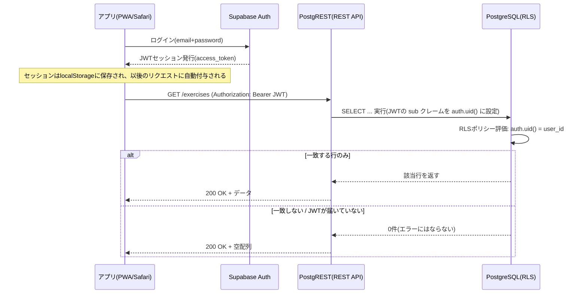

# Workout tracker 詳細設計書

## 改訂履歴

| バージョン | 日付 | 内容 |
|---|---|---|
| 1.0 | 2026-03-21 | 初版作成 |
| 1.1 | 2026-03-21 | 有酸素運動専用記録機能を追加 |
| 1.2 | 2026-03-22 | CSV出力・インポート機能を追加 |
| 1.3 | 2026-03-22 | メニュー分析機能（カレンダー・メニュービュー・グラフ）の詳細設計を追加。F-01〜F-03の仕様変更を反映 |
| 1.4 | 2026-03-22 | RM換算表設計を追加。MYST-25（有酸素未記録非表示）・MYST-26（有酸素バッジ重複修正）を反映 |
| 1.5 | 2026-08-12 | メニューセット機能の設計を追加。§11としてセキュリティ方針（エスケープ・CSP・SRI）を恒久ルール化。状態管理・Service Workerの記述を最新化 |
| 1.6 | 2026-08-15 | メニューセット詳細画面、メニュー一覧の長押し並び替え、部位「その他」の設計を追加 |
| **1.7** | **2026-09-23** | **Supabase移行（フェーズ1: メニュー管理＋認証、フェーズ3: 体重ログ・食事記録）の詳細設計を追加。RLS/RPCの設計と既知の問題（直接SELECTが0件になる現象）を記録。CSVへの`session_time`列追加、セット記録時刻の自動入力、体重推移グラフ、設定（config）画面の分離を反映。§11セキュリティ方針を更新。gl_sessions消失インシデントの記録を§13に追加** |

---

## 1. データ設計

### 1.1 localStorage キー一覧

| キー | 型 | 概要 | 状態 |
|---|---|---|---|
| `gl_menus` | JSON配列 | 登録メニューの一覧 | **Supabase(`exercises`)と併用。フォールバック用キャッシュ** |
| `gl_sessions` | JSONオブジェクト | トレーニング記録（セッション単位） | localStorageのみ（未移行） |
| `gl_menusets` | JSON配列 | メニューセットの一覧 | localStorageのみ（未移行） |

体重ログ・食事記録はlocalStorageのキーを持たない（Supabase専用、§1.9参照）。

### 1.2 gl_menus スキーマ

```json
[
  {
    "id":       "menu_1700000000000",
    "name":     "ベンチプレス",
    "category": "胸",
    "type":     "フリーウェイト",
    "archived": false
  }
]
```

| フィールド | 型 | 説明 |
|---|---|---|
| id | string | `menu_` + `Date.now()` で生成（Supabase `exercises.id`もtext型のままこの形式を踏襲） |
| name | string | メニュー名（全角30文字以内） |
| category | string | 部位（胸 / 背中 / 肩 / 足 / 腕 / その他 / 有酸素運動） |
| type | string | 種別（マシン / フリーウェイト / 自重運動 / 有酸素運動） |
| archived | boolean | アーカイブ状態（true: 一覧非表示） |

### 1.3 gl_sessions スキーマ

セッションは筋トレ・有酸素運動でデータ構造が異なる。カテゴリによって `sets` または `cardio` のどちらかが格納される。

**筋トレセッション**

```json
{
  "menu_1700000000000": {
    "sess_1700000001000": {
      "date": "2026-03-21",
      "time": "18:30",
      "sets": [
        { "w": 80, "r": 10 },
        { "w": 85, "r": 8 }
      ]
    }
  }
}
```

**有酸素運動セッション**

```json
{
  "menu_1700000000001": {
    "sess_1700000002000": {
      "date": "2026-03-21",
      "time": "07:15",
      "cardio": {
        "time":   30,
        "dist":   5.0,
        "cal":    300,
        "hr":     140,
        "maxSpd": 12.0,
        "avgSpd": 8.5
      }
    }
  }
}
```

| フィールド | 型 | 説明 |
|---|---|---|
| キー（menuId） | string | gl_menus の id と対応 |
| キー（sessionId） | string | `sess_` + `Date.now()` で生成 |
| date | string | 記録日（YYYY-MM-DD形式） |
| time | string | 記録時刻（HH:MM形式）。**新規セッション作成時は`nowTime()`で現在時刻を自動セット（§2.6参照）** |
| sets | 配列 | 筋トレのみ。セットの配列 `[{w, r}]` |
| cardio | オブジェクト | 有酸素運動のみ |

### 1.4 マイグレーション

旧バージョンのデータ形式（`gl_history`）から新形式（`gl_sessions`）への変換を初回起動時に自動実行する。

```
旧: gl_history[menuId][date] = [{w, r}, ...]
新: gl_sessions[menuId][sessionId] = { date, time:'00:00', sets:[{w, r}] }
```

変換後は `gl_history` キーを削除する。また、`time`フィールドが存在しない旧セッションには起動時に`'00:00'`を補完するマイグレーション（`migrateTime()`）を実行する。

### 1.5 gl_menusets スキーマ

```json
[
  {
    "id":      "mset_1700000000000",
    "name":    "プッシュデー",
    "menuIds": ["menu_1700000000000", "menu_1700000000002"]
  }
]
```

---

## 1.6 Supabaseテーブル定義（フェーズ1・フェーズ3）

### 1.6.1 テーブル対応表

| 旧localStorage | 移行先テーブル | 移行状況 |
|---|---|---|
| `gl_menus[]` | `exercises` | ✅ 完了（フェーズ1） |
| `gl_sessions[menuId][sessId]`（筋トレ） | `workout_sessions` + `sets` | 未着手（フェーズ2） |
| `gl_sessions[menuId][sessId]`（有酸素） | `workout_sessions` + `cardio_logs` | 未着手（フェーズ2） |
| `gl_menusets[]` | `menu_sets` + `menu_set_items` | 未着手（フェーズ2） |
| （新規） | `body_weight_logs` | ✅ 完了（フェーズ3） |
| （新規） | `meal_logs` | ✅ 完了（フェーズ3） |

### 1.6.2 ER図

```mermaid
erDiagram
    EXERCISES ||--o{ WORKOUT_SESSIONS : has
    WORKOUT_SESSIONS ||--o{ SETS : contains
    WORKOUT_SESSIONS ||--o| CARDIO_LOGS : contains
    EXERCISES ||--o{ MENU_SET_ITEMS : "included in"
    MENU_SETS ||--o{ MENU_SET_ITEMS : has

    EXERCISES {
        text id PK
        uuid user_id FK
        text name
        text category
        text type
        boolean archived
        integer sort_order
    }
    WORKOUT_SESSIONS {
        uuid id PK
        text exercise_id FK
        date session_date
        text session_time
    }
    SETS {
        uuid id PK
        uuid session_id FK
        int set_no
        numeric weight_kg
        int reps
    }
    CARDIO_LOGS {
        uuid session_id PK FK
        numeric time_min
        numeric dist_km
        numeric cal_kcal
        numeric hr_bpm
        numeric max_spd_kmh
        numeric avg_spd_kmh
    }
    MENU_SETS {
        uuid id PK
        uuid user_id FK
        text name
    }
    MENU_SET_ITEMS {
        uuid menu_set_id PK FK
        text exercise_id PK FK
    }
```

体重ログ・食事記録は他テーブルと関連を持たない独立テーブルのため上記ER図には含めない（§1.9参照）。

### 1.6.3 DDL（フェーズ1・フェーズ2分。SQL Editorで実行可能）

```sql
create table exercises (
  id text primary key,
  user_id uuid not null references auth.users(id) default auth.uid(),
  name text not null,
  category text not null,
  type text not null,
  archived boolean not null default false,
  sort_order integer not null default 0,
  created_at timestamptz not null default now()
);

create table workout_sessions (
  id uuid primary key default gen_random_uuid(),
  exercise_id text not null references exercises(id) on delete cascade,
  session_date date not null,
  session_time text not null default '00:00',
  created_at timestamptz not null default now()
);

create table sets (
  id uuid primary key default gen_random_uuid(),
  session_id uuid not null references workout_sessions(id) on delete cascade,
  set_no int not null,
  weight_kg numeric not null,
  reps int not null
);

create table cardio_logs (
  session_id uuid primary key references workout_sessions(id) on delete cascade,
  time_min numeric,
  dist_km numeric,
  cal_kcal numeric,
  hr_bpm numeric,
  max_spd_kmh numeric,
  avg_spd_kmh numeric
);

create table menu_sets (
  id uuid primary key default gen_random_uuid(),
  user_id uuid not null references auth.users(id) default auth.uid(),
  name text not null,
  created_at timestamptz not null default now()
);

create table menu_set_items (
  menu_set_id uuid not null references menu_sets(id) on delete cascade,
  exercise_id text not null references exercises(id) on delete cascade,
  primary key (menu_set_id, exercise_id)
);

create index on workout_sessions (exercise_id);
create index on sets (session_id);
create index on exercises (user_id, category, sort_order);

alter table exercises enable row level security;
alter table menu_sets enable row level security;
alter table workout_sessions enable row level security;
alter table sets enable row level security;
alter table cardio_logs enable row level security;
alter table menu_set_items enable row level security;

create policy "owner only" on exercises for all using (auth.uid() = user_id) with check (auth.uid() = user_id);
create policy "owner only" on menu_sets for all using (auth.uid() = user_id) with check (auth.uid() = user_id);

create policy "owner only via exercise" on workout_sessions for all
  using (exists (select 1 from exercises e where e.id = workout_sessions.exercise_id and e.user_id = auth.uid()))
  with check (exists (select 1 from exercises e where e.id = workout_sessions.exercise_id and e.user_id = auth.uid()));

create policy "owner only via session" on sets for all
  using (exists (select 1 from workout_sessions s join exercises e on e.id = s.exercise_id where s.id = sets.session_id and e.user_id = auth.uid()))
  with check (exists (select 1 from workout_sessions s join exercises e on e.id = s.exercise_id where s.id = sets.session_id and e.user_id = auth.uid()));

create policy "owner only via session" on cardio_logs for all
  using (exists (select 1 from workout_sessions s join exercises e on e.id = s.exercise_id where s.id = cardio_logs.session_id and e.user_id = auth.uid()))
  with check (exists (select 1 from workout_sessions s join exercises e on e.id = s.exercise_id where s.id = cardio_logs.session_id and e.user_id = auth.uid()));

create policy "owner only via menu_set" on menu_set_items for all
  using (exists (select 1 from menu_sets ms where ms.id = menu_set_items.menu_set_id and ms.user_id = auth.uid()))
  with check (exists (select 1 from menu_sets ms where ms.id = menu_set_items.menu_set_id and ms.user_id = auth.uid()));
```

`workout_sessions`〜`menu_set_items`はフェーズ2（未着手）向けのテーブル定義であり、DDL自体はSupabase側に作成済みだが、アプリからのデータ書き込みはまだ行っていない。

### 1.6.4 RPC関数（get_my_exercises）

`exercises`の読み取りは直接`.from('exercises').select()`ではなく、`security invoker`のRPC関数`get_my_exercises()`経由で行う（理由は§1.7参照）。関数本体はSQL Editorで作成済み（本ドキュメント執筆時点でDDLの再掲は省略。`supabase-client.js`の`SupaExercises.list()`実装コメントを参照）。

---

## 1.7 既知の問題: 直接SELECTがRLS正常時でも0件を返す現象

開発中に、`supabase.from('exercises').select()`のようにテーブルを直接読み取ると、認証・RLSの条件（`auth.uid() = user_id`）が正しいはずなのに**0件**が返ってくる現象を確認した。



**重要な点**: RLSによるフィルタリングは**エラーにならず「0件」として返ってくる**ため、クライアント側だけでは「クエリが失敗しているのか、単に0件なのか」が区別できない。根本原因は未特定（SDK側かPostgREST側の相性問題と推測）。

**対策**: 読み取り専用の`security invoker`なRPC関数（`get_my_exercises()`・`get_my_body_weight_logs()`・`get_my_meal_logs()`）経由に切り替えることで安定して回避できることを確認済み。そのため本アプリは**「読み取りは全てRPC関数、書き込み（insert/update/delete）は直接`.from()`」**という使い分けを恒久ルールとしている（`supabase-client.js`の全ラッパーがこのパターンに従う）。

デバッグ用に`debug_whoami()`（`select auth.uid()`を返す）・`debug_exercises_count()`関数もSQL Editorで作成し、設定画面の「Supabase接続テスト」ボタン（`testSupabaseExercises()`）から呼び出せるようにしている（§12参照。移行完了後に削除予定）。

---

## 1.8 認証設計

### 1.8.1 起動フロー（`boot()`）

```
アプリ起動
 └── SupaClient.auth.getSession() でセッション確認
       ├── セッションなし（未ログイン） → showAuthGate()：#auth-gateを表示、#appを隠す
       └── セッションあり → hideAuthGate() → loadExercisesFromSupabase() → renderList()
```

### 1.8.2 ログイン処理（`handleLogin()`）

```
#auth-email・#auth-passwordの入力値を取得
 └── 空チェック（未入力ならsetAuthError()でエラー表示、以降処理しない）
 └── SupaClient.auth.signInWithPassword(email, password)
       ├── 成功 → hideAuthGate() → loadExercisesFromSupabase() → renderList()
       └── 失敗 → setAuthError('ログインに失敗しました: ' + 詳細メッセージ)
```

ログインボタンは処理中`disabled`にし、多重送信を防止する。

### 1.8.3 認証ゲートのUI（`#auth-gate`）

未ログイン時は`#auth-gate`のみを表示し、アプリ本体（`#app`）は`display:none`にする。メール・パスワード入力欄とログインボタンのみのシンプルな画面。

---

## 1.9 メニュー管理のハイブリッド構成（Supabase＋localStorageキャッシュ）

`exercises`（メニュー）は完全にSupabase専用にはせず、**Supabaseを正、localStorage（`gl_menus`）をオフライン時のフォールバックキャッシュ**とするハイブリッド構成を取っている。

### 1.9.1 読み込み（`loadExercisesFromSupabase()`）

```
SupaClient.exercises.list() で取得（RPC経由）
  ├── 成功時:
  │     もし「Supabase側が0件」かつ「ローカルにS.menusが既にある」場合
  │       → 上書きしない（トースト表示のみ）。DDL実行直後・未移行の状態で
  │         誤ってローカルの既存メニューを消してしまう事故を防止するための安全策
  │     それ以外 → S.menus をSupabaseの内容で置き換え、persist()でlocalStorageにも反映
  └── 失敗時（オフライン等）:
        トースト表示のみ。S.menusは起動時にlocalStorageから読み込んだ内容のまま使用継続
```

### 1.9.2 書き込み

`addMenu()`・メニュー編集・アーカイブ・削除は、まず`SupaClient.exercises.*`（直接`.from('exercises')`）を呼び、成功した場合のみ`S.menus`とlocalStorageを更新する。Supabase書き込みが失敗した場合はローカルにも反映しない（クラウドとローカルの不整合を防ぐため）。

---

## 1.10 体重ログ・食事記録（フェーズ3：Supabase専用・新規実装）

段階移行（exercises/sessions）とは別に、新規機能として体重ログ・食事記録画面を追加した。既存のlocalStorage実装が存在しなかったため、**localStorageを経由せず最初からSupabaseに直接読み書きする**設計を採用している。

### 1.10.1 テーブル定義（DDL）

```sql
create table body_weight_logs (
  id uuid primary key default gen_random_uuid(),
  user_id uuid not null references auth.users(id) default auth.uid(),
  log_date date not null,
  weight_kg numeric not null,
  created_at timestamptz not null default now()
);

create table meal_logs (
  id uuid primary key default gen_random_uuid(),
  user_id uuid not null references auth.users(id) default auth.uid(),
  log_date date not null,
  meal_type text not null check (meal_type in ('朝','昼','夕','間食')),
  protein_g numeric not null,
  fat_g numeric not null,
  carb_g numeric not null,
  calories_kcal numeric generated always as (protein_g * 4 + fat_g * 9 + carb_g * 4) stored,
  created_at timestamptz not null default now()
);

create index on body_weight_logs (user_id, log_date);
create index on meal_logs (user_id, log_date);

alter table body_weight_logs enable row level security;
alter table meal_logs enable row level security;

create policy "owner only" on body_weight_logs for all using (auth.uid() = user_id) with check (auth.uid() = user_id);
create policy "owner only" on meal_logs for all using (auth.uid() = user_id) with check (auth.uid() = user_id);
```

`calories_kcal`は`GENERATED ALWAYS AS ... STORED`により`protein_g`/`fat_g`/`carb_g`からDB側で自動計算される。P=4kcal/g、F=9kcal/g、C=4kcal/gの係数を採用。INSERT時にカロリーを指定する必要はなく、アプリ側での重複計算も不要。

1日複数回の記録に対応するため一意制約は設けていない（同日同区分で複数件登録可能）。

### 1.10.2 RPC関数

```sql
create or replace function get_my_body_weight_logs()
returns table(id uuid, log_date date, weight_kg numeric, created_at timestamptz)
language sql security invoker
as $$
  select id, log_date, weight_kg, created_at
  from body_weight_logs
  where user_id = auth.uid()
  order by log_date desc, created_at desc
$$;

create or replace function get_my_meal_logs()
returns table(id uuid, log_date date, meal_type text, protein_g numeric, fat_g numeric, carb_g numeric, calories_kcal numeric, created_at timestamptz)
language sql security invoker
as $$
  select id, log_date, meal_type, protein_g, fat_g, carb_g, calories_kcal, created_at
  from meal_logs
  where user_id = auth.uid()
  order by log_date desc, created_at desc
$$;
```

### 1.10.3 supabase-client.js ラッパー（SupaBodyWeight / SupaMeals）

```javascript
const SupaBodyWeight = {
  async list() {
    const { data, error } = await getClient().rpc('get_my_body_weight_logs');
    if (error) throw error;
    return data;
  },
  async insert(entry) {
    const { data, error } = await getClient()
      .from('body_weight_logs')
      .insert({ log_date: entry.date, weight_kg: entry.weight })
      .select().single();
    if (error) throw error;
    return data;
  },
  async update(id, patch) {
    const { error } = await getClient().from('body_weight_logs').update(patch).eq('id', id);
    if (error) throw error;
  },
  async remove(id) {
    const { error } = await getClient().from('body_weight_logs').delete().eq('id', id);
    if (error) throw error;
  },
};
// SupaMealsも同型（テーブル名・カラムのみ異なる）
```

### 1.10.4 画面ロジック（体重ログ）

```
initWeightPage()（go('weight')時に呼び出し）
  └── cancelEditWeight()：編集状態をリセットし、フォームを新規入力状態に戻す
  └── loadBodyWeightLogs()：SupaClient.bodyWeight.list() でS.bodyWeightsを更新
  └── renderWeightList()：一覧描画
  └── renderWeightChart()：推移グラフ描画（§1.11参照）

editBodyWeight(id)
  └── editingWeightId に id をセット
  └── フォームに既存値（日付・体重）を流し込み
  └── 送信ボタンのテキストを「更新する」に、キャンセルボタンを表示

cancelEditWeight()
  └── editingWeightId = null
  └── フォームを空（日付=today()、体重=空欄）に戻す
  └── 送信ボタンのテキストを「記録する」に、キャンセルボタンを非表示

addBodyWeight()（送信ボタン押下）
  └── バリデーション（日付必須、体重は数値かつ0より大きいこと）
  └── editingWeightId が立っている場合 → SupaClient.bodyWeight.update(id, {log_date, weight_kg})
  └── 立っていない場合           → SupaClient.bodyWeight.insert({date, weight})
  └── 成功後: cancelEditWeight() → 再読み込み → 一覧・グラフを再描画

deleteBodyWeight(id)
  └── confirm()で確認
  └── SupaClient.bodyWeight.remove(id)
  └── 削除対象が編集中のレコードだった場合はcancelEditWeight()も実行
  └── 再読み込み → 一覧・グラフを再描画
```

食事記録（`initMealPage()`・`editMealLog()`・`cancelEditMeal()`・`addMealLog()`・`deleteMealLog()`）も同型のロジック。相違点のみ以下に記載。

### 1.10.5 画面ロジック（食事記録固有）

- `calcMealCalories(p, f, c)`: 入力中のカロリープレビュー計算（`P*4 + F*9 + C*4`）。**保存前の目安表示用**であり、実際の保存値はDB側の`GENERATED`列の計算結果を使う（二重計算だが、リアルタイムプレビューのため必要）
- `updateMealCalPreview()`: たんぱく質・脂質・炭水化物いずれかの入力（`oninput`）のたびに呼ばれ、プレビュー表示を更新
- `renderMealList()`: `S.mealLogs`を`log_date`でグループ化し、日付ごとに合計カロリー（`totalCal`）を表示してから各食事区分の行を表示
- バリデーション: たんぱく質・脂質・炭水化物のいずれも0の場合は保存不可（トースト表示）

---

## 1.11 体重推移グラフ設計

既存の「メニュー分析」画面のChart.js描画パターン（ダークモード対応の色分岐・グリッド線色）をそのまま流用し、体重ログ画面にも折れ線グラフを追加した。

### 1.11.1 表示条件

```
renderWeightChart()
  └── S.bodyWeights を log_date → created_at の順で昇順ソート（RPCの取得順は新しい順のため並び替えが必要）
  └── sorted.length < 2 の場合:
        推移が描けないためグラフカードを非表示（display:none）にし、既存Chartインスタンスがあればdestroy()
  └── 2件以上の場合:
        グラフカードを表示し、waitForChartJs(() => drawWeightChart(labels, data)) でChart.js読み込み・描画
```

同日に複数回記録した場合は、それぞれ別の点として時系列順に描画される（日付ラベルは重複表示され得る）。

### 1.11.2 描画仕様（`drawWeightChart`）

| 項目 | 内容 |
|---|---|
| グラフ種別 | 折れ線グラフ（`type: 'line'`）、`fill: true`で塗りつぶし |
| X軸ラベル | `log_date`を`fmtDate()`で整形し、先頭の年（`YYYY年`）を除去した月日表示 |
| Y軸 | kg、`beginAtZero: false` |
| 色（ライト/ダーク） | アクセント `#0ea5e9` / `#38bdf8`、グリッド `rgba(0,0,0,.06)` / `rgba(255,255,255,.06)`、目盛り `#9ca3af` / `#6b7280`（既存メニュー分析グラフと同一ロジックを`window.matchMedia('(prefers-color-scheme:dark)')`で判定） |
| ツールチップ | `${value} kg`形式でカスタム表示 |
| 凡例 | 非表示（単一系列のためタイトルで代替） |
| 既存インスタンス破棄 | 再描画のたびに`weightChart.destroy()`してから新規作成（重複描画防止） |

---

## 2. ロジック設計

### 2.1 1RM計算式

O'Conner式を採用する。

```
1RM = 重量 × (1 + 回数 ÷ 40)
```

```javascript
const orm = (w, r) => +(w * (1 + r / 40)).toFixed(1);
```

### 2.2 メニュー統計計算（menuStats）

（v1.6から変更なし。カテゴリによって筋トレ／有酸素の集計内容が異なる。）

### 2.3 メニュー名バリデーション

（v1.6から変更なし。全角30文字以内、サロゲートペアも1文字カウント。）

### 2.4 日付フォーマット

```javascript
const fmtDate = d => {
  const [y, m, day] = d.split('-');
  return `${y}年${parseInt(m)}月${parseInt(day)}日`;
};
```

### 2.5 メニュー一覧の長押し並び替え

（v1.6から変更なし。Pointer Eventsによる自前実装。）

### 2.6 セット記録画面の時刻自動入力（新規）

新規セッション作成時、これまでは記録時刻が常に`'00:00'`で初期化され、毎回手動で現在時刻に修正する必要があった。`today()`（日付取得）と同じパターンで、現在時刻を`HH:MM`形式で返す`nowTime()`ヘルパーを追加し、初期化時に使用するよう変更した。

```javascript
const nowTime = () => {
  const d = new Date();
  return `${String(d.getHours()).padStart(2,'0')}:${String(d.getMinutes()).padStart(2,'0')}`;
};
```

`openSetEdit()`内の新規セッション初期化処理（筋トレ・有酸素運動の両方）で、`time:'00:00'`を`time:nowTime()`に置き換えた。既存セッションの編集時（履歴からの選択）は保存済みの時刻がそのまま使われるため影響しない。

---

## 3. 画面詳細設計

### 3.1〜3.7（メニュー追加・一覧・詳細、セット記録、有酸素運動記録、メニューセット関連）

v1.6から機能的な変更はなし。詳細は変更履歴1.5〜1.6時点の記載を参照。セット記録画面（§3.4該当）の新規セッション作成フローのみ、時刻初期値が`'00:00'`固定から`nowTime()`（現在時刻自動取得）に変更されている（§2.6参照）。

### 3.8 体重ログ画面（weight）

#### レイアウト構成

```
page-weight
├── 記録フォームカード（日付・体重入力、記録する/更新するボタン、キャンセルボタン）
├── 体重推移グラフカード（#weight-chart-card。2件未満は非表示）
└── 記録一覧（#weight-list-body。新しい順、各行に編集・削除ボタン）
```

#### 入力項目

| 項目 | フィールドID | 単位 | inputmode | 必須 |
|---|---|---|---|---|
| 日付 | weight-inp-date | - | date | ✅ |
| 体重 | weight-inp-value | kg | decimal | ✅（0より大きい数値） |

### 3.9 食事記録画面（meal）

#### レイアウト構成

```
page-meal
├── 記録フォームカード（日付・区分・P/F/C入力、カロリープレビュー、記録する/更新するボタン、キャンセルボタン）
└── 記録一覧（#meal-list-body。日付ごとにグループ化、日別合計カロリーを併記）
```

#### 入力項目

| 項目 | フィールドID | 単位 | inputmode | 必須 |
|---|---|---|---|---|
| 日付 | meal-inp-date | - | date | ✅ |
| 区分 | meal-inp-type | - | select（朝/昼/夜/間食） | ✅ |
| たんぱく質 | meal-inp-protein | g | decimal | いずれか1つ以上 |
| 脂質 | meal-inp-fat | g | decimal | 〃 |
| 炭水化物 | meal-inp-carb | g | decimal | 〃 |

区分の選択肢はUI上「朝/昼/夜/間食」だが、DB側のCHECK制約は`('朝','昼','夕','間食')`となっている（`'夜'`と`'夕'`の表記差異）。実データは選択肢どおり「朝/昼/夜/間食」のいずれかが保存される想定のため、CHECK制約側の`'夕'`は現行UIの選択肢と一致していない点に注意（今後の修正候補）。

---

## 4. UI設計

（v1.6から変更なし。デザインコンセプト「Slate Clean」、カラートークン、タグ色定義、部位ドットカラーは既存の詳細設計書1.6版を参照。体重ログ・食事記録・設定画面も既存の`.card`・`.prog-card`・`.csv-section`等の共通コンポーネントをそのまま流用しており、新規のUIパターンは導入していない。）

---

## 5. Service Worker設計

（v1.6から変更なし。ネットワーク優先＋キャッシュfallback戦略。体重ログ・食事記録はService Workerのキャッシュ対象外であり、オフライン時は利用不可。）

---

## 6. 状態管理設計

アプリ全体の状態を `S` オブジェクトで一元管理する。

```javascript
const S = {
  menus:        [],      // gl_menus の内容（配列）※Supabaseからも取得しここへ反映
  sessions:     {},      // gl_sessions の内容（オブジェクト）
  menuSets:     [],      // gl_menusets の内容（配列）
  menu:         null,
  sessionId:    null,
  editingSetIdx: null,
  showArchived: false,
  bodyWeights:  [],      // 体重ログ（Supabase body_weight_logsのみ。localStorageには保存しない）（新規）
  mealLogs:     [],      // 食事記録（Supabase meal_logsのみ。localStorageには保存しない）（新規）
};
```

`persist()`は`menus`・`sessions`・`menuSets`のみをlocalStorageに書き戻す。`bodyWeights`・`mealLogs`はSupabaseが正であり、`persist()`の対象外。

```javascript
const persist = () => {
  localStorage.setItem('gl_menus',    JSON.stringify(S.menus));
  localStorage.setItem('gl_sessions', JSON.stringify(S.sessions));
  localStorage.setItem('gl_menusets', JSON.stringify(S.menuSets));
};
```

体重ログ・食事記録の状態更新は`loadBodyWeightLogs()` / `loadMealLogs()`が`SupaClient`から取得した結果を直接`S.bodyWeights` / `S.mealLogs`へ代入する形で行う。

---

## 7. CSV機能設計

### 7.1 エクスポート

#### 筋トレCSVフォーマット（session_time列を追加）

```
menu_name,category,type,date,session_id,session_time,set_no,weight_kg,reps,estimated_1rm_kg,volume_kg
```

| 列名 | 内容 | 備考 |
|---|---|---|
| menu_name | メニュー名 | 引用符付きで出力 |
| category | 部位 | 胸 / 背中 / 肩 / 足 / 腕 |
| type | 種別 | マシン / フリーウェイト / 自重運動 |
| date | 記録日 | YYYY-MM-DD形式 |
| session_id | セッションID | アプリ内部ID（再インポート時の重複検知に使用） |
| **session_time** | **セッション記録時刻** | **HH:MM形式。新規追加列（v1.7）** |
| set_no | セット番号 | 1始まりの連番 |
| weight_kg | 使用重量（kg） | |
| reps | 挙上回数（回） | |
| estimated_1rm_kg | 推定1RM（kg） | O'Conner式で自動計算 |
| volume_kg | セット内ボリューム（kg） | 重量 × 回数 |

#### 有酸素運動CSVフォーマット（session_time列を追加）

```
menu_name,category,date,session_id,session_time,time_min,dist_km,cal_kcal,hr_bpm,max_spd_kmh,avg_spd_kmh
```

`session_time`列の位置は`session_id`の直後（筋トレCSVと同様）。

#### session_time列を追加した経緯

現行DB設計（`workout_sessions.session_time`）と照らし合わせた結果、CSVエクスポートにセッションの記録時刻が一切含まれていない不具合を発見した。エクスポート→インポートを往復すると時刻情報が失われ`00:00`にリセットされてしまう問題があったため、`session_id`の直後に`session_time`列を追加した。

### 7.2 インポート（session_time対応・後方互換）

```javascript
// col('session_time') >= 0 && r[col('session_time')] ? r[col('session_time')].trim() : undefined
const sessionTime = col('session_time') >= 0 && r[col('session_time')] ? r[col('session_time')].trim() : undefined;
```

旧形式CSV（`session_time`列が存在しない）をインポートした場合は`sessionTime`が`undefined`のままセッションが作成され、既存の`migrateTime()`相当のフォールバック（未設定時は`'00:00'`扱い）に乗る。新形式CSVでは記録時刻がそのまま復元される。

その他のインポード仕様（重複セッションのスキップ、未登録メニューの自動登録、session_id空欄時の自動セッションまとめ）はv1.6から変更なし。

---

## 8. メニュー分析設計

（v1.6から変更なし。カレンダービュー・メニュービュー・分析詳細のロジックは既存のまま。データソースは引き続き`gl_sessions`（localStorage）。）

---

## 9. RM換算表設計（rm）

（v1.6から変更なし。O'Conner式（ベンチプレス）・33.3式（スクワット/デッドリフト）による推定1RM計算と1〜10rep換算表。）

---

## 10. ファイル構成（HTML/JS/CSS分割）

`index.html`（DOM構造）・`app.js`（全JavaScript）・`style.css`（全CSS）に加え、v1.7で**`supabase-client.js`**（Supabase JS SDK呼び出しのラッパー）を追加した。

| ファイル | 読み込み方法 |
|---|---|
| `style.css` | `<head>`内で`<link rel="stylesheet" href="./style.css">` |
| Supabase JS SDK（CDN） | `<body>`内、`supabase-client.js`より前に`<script>`タグで読み込み（SRI付き） |
| `supabase-client.js` | `<body>`内、`app.js`より前に読み込み。`window.SupaClient`をグローバルに公開するクラシックスクリプト |
| `app.js` | `<body>`末尾で読み込み（クラシックスクリプト。`type="module"`にしない） |

分割の際は移動のみとし、リファクタリング・命名変更を混ぜないこと（既存方針を継続）。

---

## 11. セキュリティ方針（恒久ルール・v1.7更新）

本アプリはGitHub Pagesで配信されるクライアントサイド完結のPWA＋Supabaseバックエンドである。`index.html`の内容は誰でも閲覧できるが、Supabaseのpublishable keyもクライアント埋め込み前提の公開キーであり、実際のアクセス制御はDB側のRLS（Row Level Security）が担う。

### 11.1 HTMLエスケープ

（v1.6から変更なし。`esc()`関数による利用者由来テキストのエスケープ。）

### 11.2 SRI（Subresource Integrity）

Chart.jsに加え、**Supabase JS SDK**（`cdn.jsdelivr.net`から読み込み）にも同様に`integrity`属性（sha384）と`crossOrigin = 'anonymous'`を設定する。

```
CDN URL: https://cdn.jsdelivr.net/npm/@supabase/supabase-js@2.116.0/dist/umd/supabase.js
integrity: sha384-...(公開ハッシュ)
```

バージョンを上げる際はハッシュの再取得・更新が必須（Chart.jsと同じ運用）。

### 11.3 CSP（Content Security Policy）

Supabase移行に伴い、`connect-src`にSupabaseプロジェクトURLを、`script-src`にSupabase JS SDKの配信元（jsdelivr）を追加した。

```html
<meta http-equiv="Content-Security-Policy" content="
  default-src 'self';
  script-src 'self' 'unsafe-inline' https://cdnjs.cloudflare.com https://cdn.jsdelivr.net;
  style-src 'self' 'unsafe-inline' https://fonts.googleapis.com;
  font-src https://fonts.gstatic.com;
  img-src 'self' data:;
  connect-src 'self' https://swncmbsamxoyjeojwbyc.supabase.co">
```

この変更を行わないとSupabaseへのfetch/WebSocket通信がすべてブロックされる。`onclick`属性を多用するため`script-src`/`style-src`の`'unsafe-inline'`は引き続き維持する。

### 11.4 リポジトリ衛生

（v1.6から変更なし。`.gitignore`での機密ファイル除外。）

### 11.5 Supabaseキーの取り扱い（新規）

| キー | 扱い |
|---|---|
| publishable key（`sb_publishable_...`） | `supabase-client.js`に直書きしてよい（クライアント埋め込み前提。実アクセス制御はRLSが担う） |
| secret key（`sb_secret_...`） | **絶対にクライアントコードへ埋め込まない**（RLSを迂回できる管理者キーのため） |

---

## 12. 設定（config）画面設計（新規・一時的）

### 12.1 目的

Supabase移行（フェーズ1・フェーズ3）の検証・トラブルシューティング用に、CSV画面にあった4つの一時的なデバッグ・移行ツールを、サイドバーに新設した「設定」ページ（`page-config`）に分離した。CSV画面は本来のエクスポート/インポート機能のみに整理した。

### 12.2 機能一覧（すべて一時的。フェーズ2完了後に削除予定・B-15）

| 機能 | 関数 | 内容 |
|---|---|---|
| メニュー一覧データを表示 | `showMenusDebug()` | `localStorage.getItem('gl_menus')`の生データをテキストエリアに表示。全選択してコピー可能 |
| セッションデータを表示 | `showSessionsDebug()` | `localStorage.getItem('gl_sessions')`の生データを表示。`gl_menus`消失時の復旧用（menuIdをキーとする構造なのでCSVと突き合わせて復元可能） |
| Supabase接続テスト | `testSupabaseExercises()` | 現在のセッション情報・`SupaClient.exercises.list()`の結果またはエラー・`debug_whoami()`（DB側の`auth.uid()`）・`debug_exercises_count()`の結果をまとめてJSON表示 |
| セッションデータを復旧インポート | `importRecoveredSessions()` | 9/12バックアップCSVから復元した`recovered_sessions_2026-09-12.json`を同一オリジンから`fetch()`し、既存の`gl_sessions`に**マージのみ**（既存キーは上書きしない）でインポート |

これらはSupabase移行の検証・過去のデータ消失インシデント対応のために追加した一時的な機能であり、フェーズ2（セッション/セットのSupabase移行）完了後、`debug_whoami()`・`debug_exercises_count()`のSQL関数含めて削除してよい。

---

## 13. 障害対応記録: gl_sessions消失インシデントと復旧（2026年9月）

### 13.1 事象

フェーズ1（メニュー管理のSupabase移行）適用後、iPhone側で`gl_sessions`（トレーニング記録）が完全に空（`{}`）になっている状態を確認した。設定画面の`showSessionsDebug()`で実際に空であることを確認しており、単なるID不一致ではなく実データの消失であった。根本原因は未特定（PWA再インストール時のストレージ初期化等が推測されるが確証はない）。

### 13.2 復旧方法

9月12日時点でエクスポート済みだったCSVバックアップ（1046行・26メニュー分）を、現在のSupabase `exercises`一覧（28件）と名前・部位・種別で突き合わせ、全26メニューが一意に一致することを確認した上で、`gl_sessions`と同じ構造のJSON（`recovered_sessions_2026-09-12.json`）を再構築した。

復旧インポートは、既存キー（menuId・sessionIdの組み合わせ）が既にある場合は**上書きしない**マージ方式（`importRecoveredSessions()`、§12.2）とし、万一の二重適用でもデータが壊れない設計にした。

### 13.3 教訓・再発防止

- `gl_sessions`・`gl_menusets`はフェーズ2完了までlocalStorage依存が続くため、§5.4の「PWAアイコン更新時の注意事項」を徹底する
- CSVエクスポートを定期的なバックアップ手段として案内する
- 今回の調査過程で、CSVエクスポート自体に`session_time`列が欠落しておりエクスポート→インポート往復で時刻情報が失われる別の不具合も発見し、§7で修正済み
