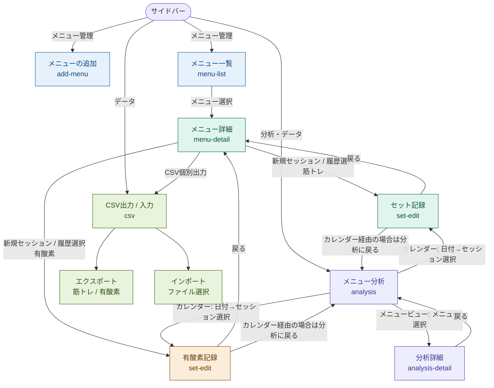
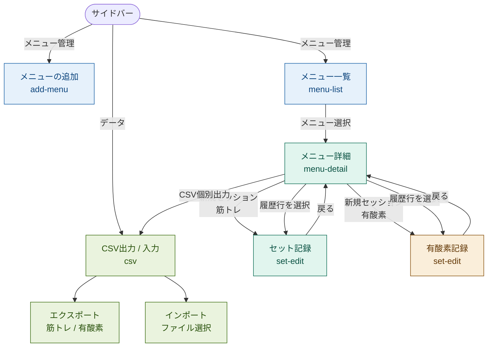

# GymLog 画面遷移図

## 改訂履歴

| バージョン | 日付 | 内容 |
|---|---|---|
| 1.0 | 2026-03-22 | 初版作成 |
| 1.1 | 2026-03-22 | メニュー分析・分析詳細画面を追加。F-01〜F-03の遷移変更を反映 |

---

## 画面一覧

| 画面名 | 画面ID | 色分け |
|---|---|---|
| メニューの追加 | add-menu | 青 |
| メニュー一覧 | menu-list | 青 |
| メニュー詳細 | menu-detail | 緑 |
| セット記録（筋トレ） | set-edit | 緑 |
| 有酸素記録 | set-edit | 橙 |
| メニュー分析 | analysis | 紫 |
| 分析詳細 | analysis-detail | 紫 |
| CSV出力 / 入力 | csv | 緑 |

---

## 遷移図

---

## 遷移詳細

### サイドバーからの遷移

| 遷移先 | 操作 |
|---|---|
| メニューの追加 | サイドバー「メニューの追加」をタップ |
| メニュー一覧 | サイドバー「メニュー一覧」をタップ |
| メニュー分析 | サイドバー「メニュー分析」をタップ |
| CSV出力 / 入力 | サイドバー「CSV出力 / 入力」をタップ |

### メニュー一覧からの遷移

| 遷移先 | 操作 |
|---|---|
| メニュー詳細 | メニュー行をタップ |

### メニュー詳細からの遷移

| 遷移先 | 操作 | 条件 |
|---|---|---|
| セット記録（筋トレ） | 「新規セッション」ボタン | 筋トレメニューかつ非アーカイブ時 |
| 有酸素記録 | 「新規セッション」ボタン | 有酸素運動メニューかつ非アーカイブ時 |
| セット記録（既存） | 履歴テーブルの行をタップ | 記録済みセッションがある場合 |
| CSV個別出力 | 「CSV出力」ボタン | ダウンロード（画面遷移なし） |
| メニュー一覧 | 「一覧に戻る」ボタン | — |

### セット記録 / 有酸素記録からの遷移

| 遷移先 | 操作 | 条件 |
|---|---|---|
| メニュー詳細 | 「詳細に戻る」ボタン | メニュー詳細から遷移した場合 |
| メニュー分析 | 「詳細に戻る」ボタン | カレンダーから遷移した場合（F-03） |

### メニュー分析からの遷移

| タブ | 操作 | 遷移先 |
|---|---|---|
| カレンダー | 日付タップ → セッション行をタップ | セット記録（該当セッション）（F-02） |
| メニュービュー | メニュー行をタップ | 分析詳細 |

### 分析詳細からの遷移

| 遷移先 | 操作 |
|---|---|
| メニュー分析 | 「分析に戻る」ボタン |

### CSV画面からの遷移

| 操作 | 動作 |
|---|---|
| 筋トレ記録をエクスポート | CSVファイルをダウンロード（画面遷移なし） |
| 有酸素運動記録をエクスポート | CSVファイルをダウンロード（画面遷移なし） |
| CSVファイルを選択してインポート | ファイル選択ダイアログを開き取り込み実行（画面遷移なし） |

---

## 補足

- セット記録画面（set-edit）は筋トレ・有酸素運動で同じ画面IDを共有し、メニューのカテゴリによって表示フォームが切り替わる
- CSV出力・インポートはすべて画面遷移なし（同一画面内で完結）
- アーカイブ済みメニューでは「新規セッション」ボタンが非表示になり、セット記録への遷移は不可
- カレンダーからセット記録に遷移した場合は、戻るボタンの遷移先がメニュー分析画面になる（F-03）

---

## 画面一覧

| 画面名 | 画面ID | 色分け |
|---|---|---|
| メニューの追加 | add-menu | 青 |
| メニュー一覧 | menu-list | 青 |
| メニュー詳細 | menu-detail | 緑 |
| セット記録（筋トレ） | set-edit | 緑 |
| 有酸素記録 | set-edit | 橙 |
| CSV出力 / 入力 | csv | 緑 |

---

## 遷移図

---

## 遷移詳細

### サイドバーからの遷移

| 遷移先 | 操作 |
|---|---|
| メニューの追加 | サイドバー「メニューの追加」をタップ |
| メニュー一覧 | サイドバー「メニュー一覧」をタップ |
| CSV出力 / 入力 | サイドバー「CSV出力 / 入力」をタップ |

### メニュー一覧からの遷移

| 遷移先 | 操作 |
|---|---|
| メニュー詳細 | メニュー行をタップ |

### メニュー詳細からの遷移

| 遷移先 | 操作 | 条件 |
|---|---|---|
| セット記録（筋トレ） | 「新規セッション」ボタン | 筋トレメニューかつ非アーカイブ時 |
| 有酸素記録 | 「新規セッション」ボタン | 有酸素運動メニューかつ非アーカイブ時 |
| セット記録（既存） | 履歴テーブルの行をタップ | 記録済みセッションがある場合 |
| CSV個別出力 | 「CSV出力」ボタン | ダウンロード（画面遷移なし） |
| メニュー一覧 | 「一覧に戻る」ボタン | — |

### セット記録 / 有酸素記録からの遷移

| 遷移先 | 操作 |
|---|---|
| メニュー詳細 | 「詳細に戻る」ボタン |

### CSV画面からの遷移

| 操作 | 動作 |
|---|---|
| 筋トレ記録をエクスポート | CSVファイルをダウンロード（画面遷移なし） |
| 有酸素運動記録をエクスポート | CSVファイルをダウンロード（画面遷移なし） |
| CSVファイルを選択してインポート | ファイル選択ダイアログを開き取り込み実行（画面遷移なし） |

---

## 補足

- セット記録画面（set-edit）は筋トレ・有酸素運動で**同じ画面ID**を共有し、メニューのカテゴリによって表示フォームが切り替わる
- CSV出力・インポートはすべて**画面遷移なし**（同一画面内で完結）
- アーカイブ済みメニューでは「新規セッション」ボタンが非表示になり、セット記録への遷移は不可
